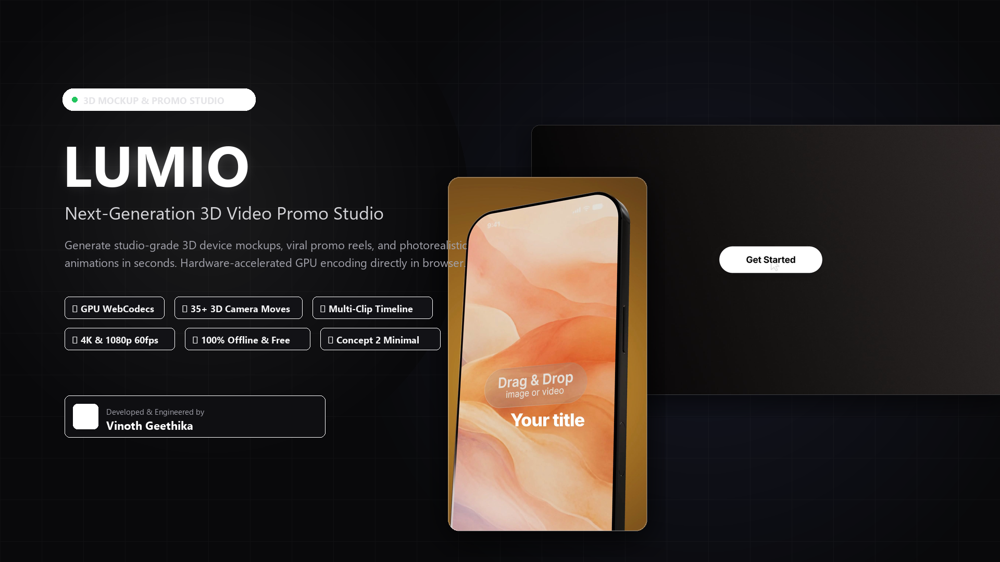

<div align="center">

# 🎬 LUMIO Studio
### Next-Generation 3D Device Mockup & Video Promo Studio
**Hardware-Accelerated Client-Side Rendering • 100% Offline Capable • Pro Features Unlocked**

[](https://github.com/vinothgeethika)
[](https://threejs.org/)
[](https://www.khronos.org/webgl/)
[](https://w3c.github.io/webcodecs/)
[](https://ffmpegwasm.netlify.app/)
[](#)

<br/>



</div>

---

## 🌟 Overview

**LUMIO Studio** is an ultra-modern, browser-based creative suite that generates high-end 3D product animations, app mockups, and multi-clip promotional videos. Engineered with a sleek obsidian aesthetic, precision-cut UI cards, and real-time WebGL rendering, LUMIO empowers creators and developers to produce studio-grade 1080p and 4K MP4 promotional videos directly inside their browser with zero cloud render queues or monthly subscriptions.

> **Engineered & Developed by [Vinoth Geethika](https://github.com/vinothgeethika)**

---

## ✨ Key Features

### 1. 📱 3D Mockup Studio (Single Scene Mode)
* **Photorealistic 3D Devices**: Highly detailed iPhone 16 Pro, Samsung Galaxy, and MacBook Pro models featuring physically-based rendering (PBR), dynamic screen reflections, customizable chassis colors, and warehouse HDR studio lighting.
* **35+ Handcrafted Camera Moves**: Cinematic floating, rotating, orbit, slide, and hero presentation animations in both **16:9 Landscape** and **9:16 Portrait / Reel / Story** aspect ratios.
* **Instant Drag & Drop Screen Injection**: Drop PNG, JPG, WebP, or MP4 screen recordings straight onto the 3D device glass with automatic perspective UV mapping.
* **Studio Lighting Control**: Adjustable studio spotlight intensity, ambient environment lighting, shadow blur samples, and transparent background alpha exports.

### 2. 🎞️ Multi-Clip Promo Editor (Timeline Mode)
* **Non-Linear Multi-Clip Storyboard**: Sequence 3D device mockup clips, animated typography cards, motion graphics, and background music tracks on an intuitive timeline.
* **Pre-Built Template Library**: High-converting promotional video templates with instant live 1080p hover previews.
* **Save & Hydrate Projects**: Save full project packs locally (`.lumio-project.zip`) and reload anytime with zero loss of state.

### 3. ⚡ Local Hardware-Accelerated Video Rendering
* **WebCodecs GPU Fast Encoder**: Direct GPU-to-video encoding via hardware-accelerated AVC/H.264, exporting 30fps/60fps videos in seconds.
* **Bundled FFmpeg WebAssembly Core**: Self-hosted local `ffmpeg-core.wasm` fallback for complete cross-browser encoding compatibility without network latency.
* **100% Offline & Unlocked**: Unlimited export credits, full 4K UHD rendering unlock, and zero watermark restrictions.

---

## 🎨 Design System: Sleek Monochrome Studio

LUMIO features an architectural, minimalist interface inspired by high-end creative workstations:
* **Matte Obsidian Palette**: Root background `#09090b` with elevated `#111114` card surfaces.
* **Sharp Architectural Geometry**: Card border-radius tuned to a crisp `8px` for a clean, modern aesthetic.
* **Hairline Borders**: Subtle `1px solid rgba(255, 255, 255, 0.08)` borders with dynamic focus states.
* **High-Contrast Typography**: Ultra-legible sans-serif Figtree typography with crisp white accent action buttons.

---

## 📁 Project Structure

```plaintext
lumio-studio/
├── _next/                      # Compiled Next.js application bundles & chunks
│   └── static/
│       ├── chunks/             # Dynamic Webpack chunks (Three.js, workers, Promo Editor)
│       └── css/                # Studio stylesheets & design tokens
├── api/                        # Local mock API endpoints & hydration stubs
├── computers/                  # 3D GLTF/GLB models for MacBook & desktop screens
├── environment/                # High dynamic range (HDR) warehouse lighting
├── ffmpeg/                     # Offline FFmpeg WebAssembly engine
│   ├── ffmpeg-core.js          # Core WASM loader
│   ├── ffmpeg-core.wasm        # Split-chunk Cloudflare-ready WASM engine
├── functions/                  # Cloudflare Pages serverless functions
├── phones/                     # 3D GLTF/GLB models for iPhone, Samsung, OnlyScreen
├── previews/                   # 1080p template preview videos & thumbnail gallery
├── Animation_*.glb             # 35+ Landscape 16:9 camera & device animation rigs
├── Vertical_Animation_*.glb    # 27+ Portrait 9:16 camera & device animation rigs
├── app.html                    # Main LUMIO Studio application entrypoint
├── index.html                  # Landing page & SEO entrypoint
├── banner.png                  # High-resolution README hero banner
├── fav.png                     # LUMIO Monogram high-res icon
├── package.json                # Project metadata & deployment scripts
└── README.md                   # Project documentation
```

---

## 🛠️ Quick Start

### Prerequisites
* Any modern web browser (Google Chrome, Microsoft Edge, Brave, or Firefox) with Hardware Acceleration enabled.

### Running Locally

```bash
# Option 1: Using Node.js (Recommended)
npm run dev

# Option 2: Using Python built-in server
python -m http.server 5500
```

Open your browser and navigate to:
```
http://127.0.0.1:5500/app.html
```

---

## ☁️ Cloudflare Pages Deployment

LUMIO is pre-configured for instant zero-config deployment to **Cloudflare Pages**:

```bash
npm run deploy
```

For detailed Cloudflare deployment notes and large WASM split-handling documentation, see [CLOUDFLARE_DEPLOY.md](CLOUDFLARE_DEPLOY.md).

---

## ⌨️ Keyboard Shortcuts

* **`Spacebar`**: Play / Pause 3D animation timeline playback.
* **`Ctrl + S` / `Cmd + S`**: Save LUMIO project pack to disk.
* **`Ctrl + E` / `Cmd + E`**: Open video export configuration modal.
* **`F`**: Toggle full-screen 3D viewport mode.

---

## 👨‍💻 Developer & Author

**Vinoth Geethika**  
* GitHub: [@vinothgeethika](https://github.com/vinothgeethika)  
* Repository: [https://github.com/vinothgeethika/LUMIO](https://github.com/vinothgeethika/LUMIO)

---

<div align="center">
Built with precision by <strong>Vinoth Geethika</strong>.
</div>
